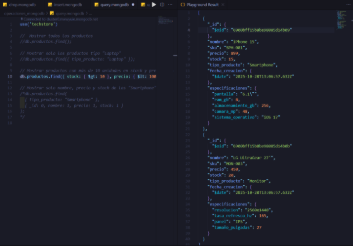

INFORME TÉCNICO – MongoDB: Caso “TechStore”

Alegria Valle Adonis

Fase 1

1. Análisis Comparativo (SQL vs NoSQL)

|**Criterio**|**Solución Relacional (SQL)**|**Solución NoSQL (MongoDB)**|**Justificación para "TechStore**|
| :-: | :-: | :-: | :-: |
|**Flexibilidad de Esquema**|La forma en la que se requiere realizar cambios alguna tabla se requiere el uso de una consulta para modificar o crear una nueva tabla|El esquema es mas flexible dado que se basa en documentos tipo json/bson y permite modificar campos sin afectar los demás registros.|En *TechStore* hay productos muy variados (ej. laptops, teclados, auriculares, smartwatches) que no siempre comparten las mismas características. Esto permite que Mongo permite guardar todos en la misma colección sin importar los campos que posean cada uno.|
|**Modelo de Datos**|Se permite la creación de múltiples tablas interrelacionadas normalizadas.|Con el uso de las colecciones de documentos permite agrupar la información de un producto en un solo registro|En lugar de tener que hacer JOINs entre productos y tipo\_producto, cada documento de TechStore puede incluir un campo embebido con la información del tipo de producto|
|**Consulta de Datos**|Si la BDD contiene muchas tablas y relaciones el rendimiento de consultas disminuye considerablemente|Las consultas se realizan sobre documentos lo que evitando el uso de JOINs y devolviendo resultados más rápidos.|Al consultar los productos devuelve la información de manera rápida con todos sus campos, asi mejora la velocidad de respuesta del sistema.|

1. Diseño del Modelo Relacional (Conceptual):

   En el modelo relacional se contemplan las siguientes entidades principales:

- Productos: Contiene información general (nombre, precio, stock).
- Tipos de producto: Define categorías como Laptop, Smartphone o Monitor.
- Especificaciones: Tabla relacionada con las características técnicas de cada producto.

Nota: Se representa en una sola identidad debido a que podemos crear subdocumentos dentro del documento asi puede tener sus popias características sin necesidad de ser aplicada a las demás.

1. Diseño del Modelo NoSQL (MongoDB)

   A continuación, se presenta la estructura en formato JSON usada para la colección productos, demostrando la flexibilidad del modelo.

   {

   `  `"\_id": "ObjectId()",

   `  `"nombre": "Laptop HP Pavilion",

   `  `"sku": "LAP123",

   `  `"precio": 950,

   `  `"stock": 15,

   `  `"tipo\_producto": "Laptop",

   `  `"fecha\_creacion": "ISODate()",

   `  `"especificaciones": {

   `    `"cpu": "Intel i7",

   `    `"ram\_gb": 16,

   `    `"dimensiones": { "alto\_cm": 2.3, "ancho\_cm": 34, "peso\_kg": 1.9 }

   `  `}

   }

   Este esquema demuestra cómo los productos pueden tener atributos diferentes sin alterar la estructura de la colección.

   Fase 2: Implementación y Manipulación

   Creación de archivos de operaciones “Operaciones\_mongodb”, dentro de la carpeta se encontrarán los siguientes archivos:

- drop.mongodb: Sera el encargado de limpiar las colecciones existentes.
- insert.mongodb: Sera el encargado de agregar los nuevos documentos.
- query.mongodb: Nos permite realizar consultas a la colección sea general o especifico. 
- update.mongodb: Nos permite actualizar el campo de un documento sin modificar todos los registros.

Inserción de Datos (Create)

El archivo consta con los comandos necesarios para poder agregar algunos documentos a la misma vez con el comando insert.Many

Lectura de Datos (Read)

Dentro nos permitirá buscar todos los registros, consultar el producto por tipos en este caso “Laptop”, podemos mostrar el registro que conste con 10 unidades en inventario y con un coste menor a 1000 y por ultimo Mostrar solo el nombre, precio y stock de los "Smartphone"

Actualización de Datos (Update)

Este apartado nos permite poder actualizar el inventario posterior a una venta, lo que realizará será disminuir una unidad post venta. De la misma manera si se requiere actualizar el precio de un producto permitirá aplicar el cambio a todas las unidades disponibles de ese producto.

Fase 3: Documentación de Resultados
Resultados de la Ejecución / Ejecución y Captura

Uso del drop a la coleccion

Insecion de los documentos.

 

Consultas de las colecciones

   

Actualizacion de los registros.

|Antes de actulizar|Después de actualizar|
| :- | :- |
|||

Fase 4: Análisis Reflexivo

Análisis Reflexivo

¿Cuál fue la ventaja más significativa de usar un modelo de documento (MongoDB) para el caso "TechStore" en comparación con el modelo relacional que diseñó?

Una de las ventajas que mas se aplica es la flexibilidad de las estructuras de los documentos, en un modelo relacional cada producto necesita su propia tabla o relaciones lo que hace que sea más complejo. Mongo permite que cada producto trabaje de manera autónoma donde sus componentes se almacenan juntas sin importar las de los demás documentos.

¿Cómo facilita el anidamiento de documentos (el campo especificaciones) la gestión de datos heterogéneos (diferentes atributos por producto)?

El anidamiento de documentos permite que cada producto posea su propio conjunto de campos personalizados sin afectar la estructura general de la colección.

Las características que tienen un producto pueden ser diferentes a los demás productos, con ello se puede manejar de mejor manera el almacenamiento de cada una de sus características sin necesidad de crear nuevas tablas y relaciones, permite que cada documento posea su propio “subdocumento”.

¿Qué problemas potenciales podría enfrentar esta base de datos a futuro si no se controla la flexibilidad del esquema (es decir, si se permite insertar cualquier dato)?

Una de las principales desventajas es que puede perder la consistencia estructural, cada documento puede almacenar la información que necesite, pero pueden ser datos irrelevantes o malas inserciones de datos, el control del ingreso de datos depende del usuario que lo maneje o del programa como permita agregar los registros.

¿Qué paso técnico recomendaría a continuación para "profesionalizar" esta base de datos? (Piense en rendimiento e integridad de datos que no cubrimos en este laboratorio).

El siguiente paso técnico sería implementar validadores JSON Schema directamente en las colecciones de MongoDB. Esto nos permite validar el ingreso de datos como campos obligatorios, valores, rangos así con ellos tener un mejor control de los datos ingresados.

